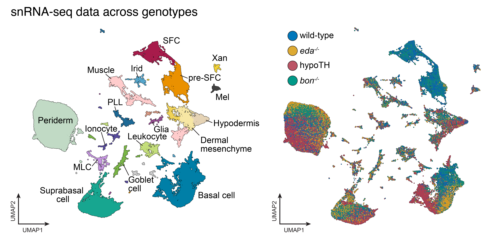

# Zebrafish skin transcriptomics

## Table of Contents

- [Introduction](#introduction)
- [Features](#features)
- [License](#license)

## Introduction

This code accompanies the publication [Aman, A., Saunders, L. et al., eLife (2023)](https://doi.org/10.7554/eLife.86670.3) and contains key analyses and code to generate all plots related to the sci-RNA-seq data in the paper. 

The data to run all of this code is available in the `data` directory here or via our GEO repository under accession number [GSE224695](https://www.ncbi.nlm.nih.gov/geo/query/acc.cgi?acc=GSM7029635).

## Features

Our data includes whole-skin, single nucleus transcriptome data from four different genotypes and treatments in post-embryonic zebrafish:
    1. wild type 
    2. Eda mutants
    3. Bnc2 mutants
    4. Hypothyroid fish (via embryonic thryoid gland ablation)

## License

This project is licensed under the MIT License.
